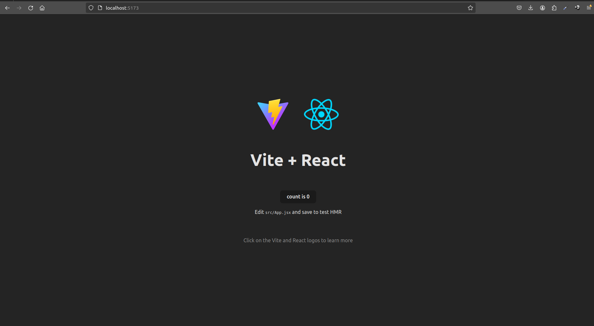

# Lab 01 - Hello World


Neste laboratório, você aprenderá a configurar um ambiente de desenvolvimento React, criando e executando seu primeiro aplicativo "Hello World".

## Orientações
1. Instale o [Node.js](https://nodejs.org/en/about):
```bash
# Passo 1
curl -fsSL https://deb.nodesource.com/setup_lts.x | sudo -E bash -

# Passo 2
sudo apt-get install -y nodejs
```

2. Crie um projeto React com [Vite](https://vitejs.dev/) com a linguagem de programação javascript:
```bash
# Passo 1
npm create vite@latest app-react
```

3. Adicione informações de host (0.0.0.0) e porta (80) ao arquivo [vite.config.js](./app-react/vite.config.js)

```js
// Exemplo
import { defineConfig } from 'vite'
import react from '@vitejs/plugin-react'

export default defineConfig({
  plugins: [react()],
  server: {
    port: 80, // Defina a porta
    host: "0.0.0.0", //Defina o host
    strictPort: true,
  },
})

```

4. Inicie o aplicativo React:
```bash
# Passo 1
docker compose up -d
```

4. Abre o navegador em [localhost:5173](http://127.0.0.1:5173);
resultado esperado:



### Links úteis:
- [Como instalar o Node.js](https://balta.io/blog/node-npm-instalacao-configuracao-e-primeiros-passos)
- [Como instalar o Docker](https://docs.docker.com/engine/install/)

Se precisar de ajuda, entre em contato. Bom laboratório!